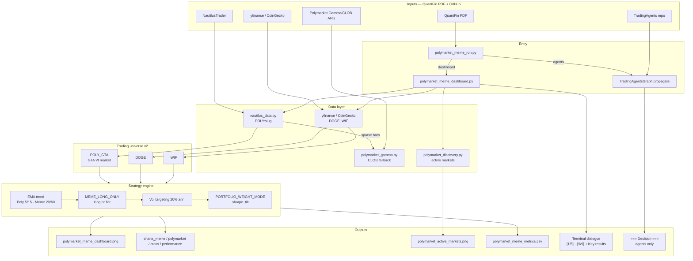
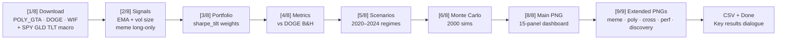
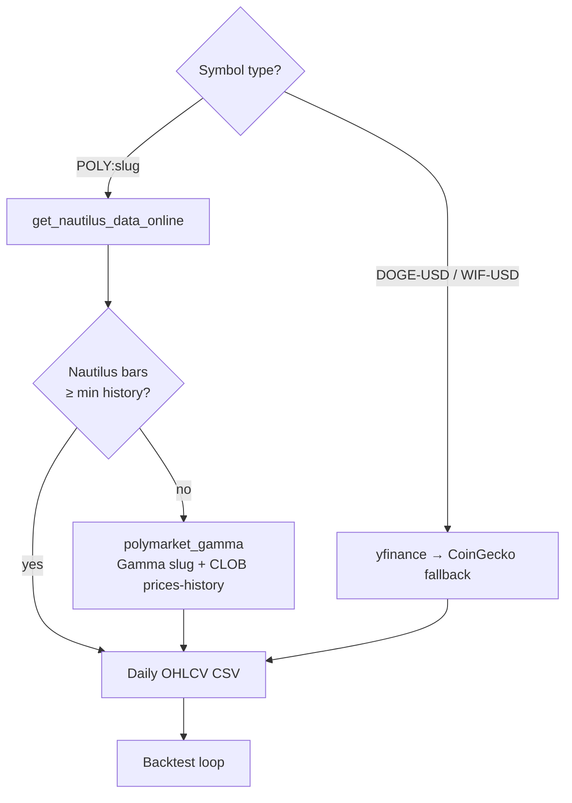
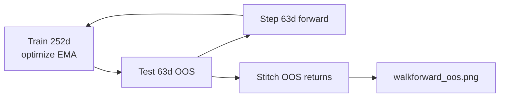
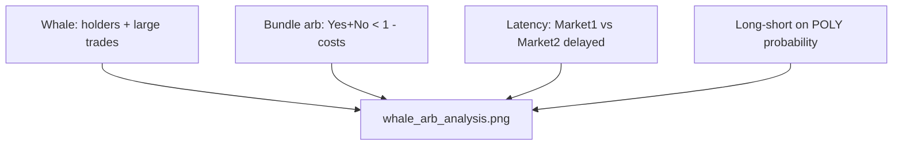

# Polymarket + Meme Coins Project

Quantitative risk + multi-agent research stack built on **TradingAgents**, aligned with *GlobalAi26 QuantFin Risk Management* course resources.

## Architecture (v2)

### System overview



### Dashboard pipeline (terminal steps)



### Data routing (per symbol)



| Layer | Tool | Role |
|-------|------|------|
| Prediction markets | [NautilusTrader](https://github.com/nautechsystems/nautilus_trader) or **Gamma/CLOB API** | `POLY:gta-vi-released-before-june-2026` |
| Meme spot | yfinance + CoinGecko | **DOGE**, **WIF** (v2 universe) |
| Strategy | EMA + vol target + **meme long-only** + **sharpe_tilt** | Portfolio Sharpe target ≥ 0 |
| Charts | `polymarket_meme_chart_panels.py` | 5 extended PNGs + main dashboard |
| Research agents | [TradingAgents](https://github.com/TauricResearch/TradingAgents) | Optional `agents` → `=== Decision ===` |
| Market scan | Gamma API via `polymarket_discovery.py` | `polymarket_active_markets.png` |
| External bots | [Polymarket/agents](https://github.com/Polymarket/agents) etc. | Documented in [GITHUB_INTEGRATION.md](./GITHUB_INTEGRATION.md) |

## Quick start

```bash
cd TradingAgents
pip install -e ".[dev]"   # or your env
pip install yfinance scipy matplotlib numpy requests

# 1) Regenerate dashboard + metrics
python scripts/polymarket_meme_run.py dashboard

# 2) LLM multi-agent pass on a meme ticker (requires API keys in .env)
python scripts/polymarket_meme_run.py agents --ticker DOGE-USD --date 2025-05-01

# 3) Both
python scripts/polymarket_meme_run.py all --ticker DOGE-USD --date 2025-05-01
```

Outputs (see [GITHUB_INTEGRATION.md](./GITHUB_INTEGRATION.md)):

- `polymarket_meme_dashboard.png` — main strategy dashboard
- `polymarket_meme_charts_meme.png` — meme coin analysis
- `polymarket_meme_charts_polymarket.png` — Polymarket probability
- `polymarket_meme_charts_cross.png` — cross-asset / risk
- `polymarket_meme_charts_performance.png` — risk-return summary
- `polymarket_active_markets.png` — Gamma API market discovery
- `polymarket_meme_metrics.csv`

## Data vendors

Set in config or environment:

```python
config["data_vendors"]["core_stock_apis"] = "nautilus"
```

| Symbol | Meaning |
|--------|---------|
| `POLY:gta-vi-released-before-june-2026` | Polymarket Yes price (0–1) |
| `DOGE-USD` | Falls back to yfinance via nautilus router |

Optional full Nautilus install:

```bash
pip install -U "nautilus_trader[polymarket]"
```

Without it, `tradingagents.dataflows.polymarket_gamma` uses public Gamma + CLOB endpoints.

## Universe (dashboard v2)

| Leg | Symbol | Notes |
|-----|--------|--------|
| Polymarket | **POLY_GTA** | `gta-vi-released-before-june-2026`; long/short |
| Meme | **DOGE**, **WIF** | long-or-flat only |
| Excluded | PEPE, BONK, SHIB, UMA | Removed — hurt portfolio Sharpe under old rules |
| Benchmark | DOGE buy & hold | Scorecard reference |
| Macro (corr only) | SPY, GLD, TLT | Not traded |

## Phase 2 — now implemented

| PDF item | Command | Output |
|----------|---------|--------|
| **Qlib** | `python scripts/polymarket_walkforward_qlib.py` | `data/qlib_crypto/*.csv`, LGBModel or sklearn fallback |
| **Walk-forward OOS** | same | `polymarket_walkforward_oos.png`, `polymarket_walkforward_metrics.csv` |
| **Solana arb (#3 Rust/Jito)** | `python scripts/solana_arb_bridge.py setup` | [integrations/solana_arbitrage](../integrations/solana_arbitrage/) |

```bash
python scripts/polymarket_meme_run.py walkforward
python scripts/polymarket_meme_run.py solana-setup
pip install -e ".[quant]"   # optional: pyqlib + sklearn
```

### Walk-forward diagram



### Whale + Arbitrage module

```bash
python scripts/polymarket_meme_run.py whale-arb
```

| Feature | Implementation |
|---------|----------------|
| **Whale** | Data API `/holders`, `/trades` (cash filter), concentration HHI |
| **Bundle arb** | Yes+No ask sum &lt; $1 − fees − gas − min profit bps |
| **Latency** | DOGE (fast) vs POLY Yes (lag 0–5d), hit-rate vs tx costs |
| **Long-short** | EMA on Polymarket implied probability |
| **Patterns** | Historical count of profitable arb windows |

Outputs: `polymarket_whale_arb_analysis.png`, `polymarket_whale_arb_metrics.csv`



Still Phase 2 (optional): Kalshi cross-venue arb, [Kronos](https://github.com/shiyu-coder/Kronos).

## Disclaimer

For research and education only. Not financial advice.
