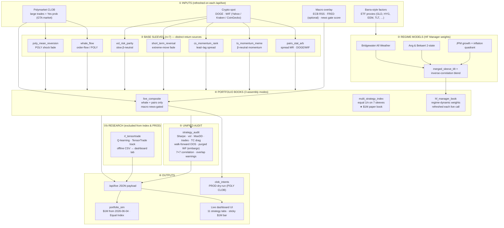
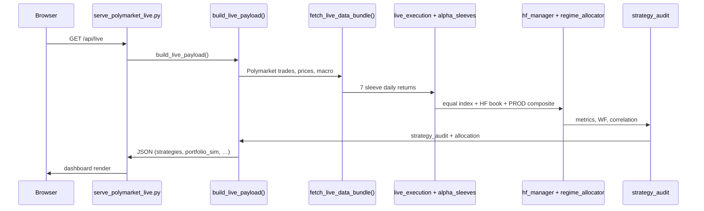
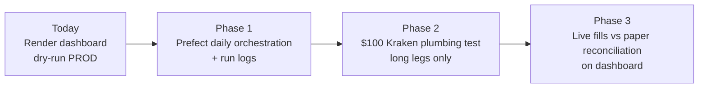

# Polymarket Live Dashboard — System Workflow (v2.8)

**Dashboard:** https://polymarket-live-dashboard.onrender.com/  
**Repo:** TradingAgents · `tradingagents/quant/` + `assets/dashboard_outputs/live_app/`  
**Version:** `2.8-rl-purged-audit`

---

## End-to-end workflow

---

## Strategy list (11 dashboard tabs)

| Layer | ID | Role |
|-------|-----|------|
| **Book** | `live_composite` | PRODUCTION — whale + pairs, news-gated → CLOB intents |
| **Book** | `multi_strategy_index` | Equal 1/n benchmark — **official $1M paper PnL** |
| **Book** | `hf_manager_book` | Regime-dynamic blend (Ang + JPM + Bridgewater tilt) |
| **Sleeve** | `whale_flow` | Polymarket large-trade flow + EMA trend |
| **Sleeve** | `pairs_stat_arb` | DOGE/WIF log-spread z-score mean reversion |
| **Sleeve** | `ts_momentum_meme` | 15d β-neutral residual momentum |
| **Sleeve** | `cs_momentum_rank` | DOGE→WIF lead–lag spread |
| **Sleeve** | `short_term_reversal` | Fade \|5d\| ≥ 8% basket moves |
| **Sleeve** | `poly_mean_reversion` | Fade ≥2.5% daily Yes-prob shocks |
| **Sleeve** | `vol_risk_parity` | 25d slow β-neutral diversifier |
| **Research** | `rl_tensortrade` | Offline Q-learning (TensorTrade env); not in Index or PROD |

**Tradable assets:** POLY_GTA (prediction market) · DOGE · WIF — no equities.

---

## Data flow (one refresh cycle)

---

## Status & performance (as of architecture v2.8)

| Item | Status |
|------|--------|
| **Hosting** | Render.com — auto-deploy from `main` (`render.yaml`) |
| **Live execution** | PROD CLOB = **dry-run** only (`POLYMARKET_LIVE` off) |
| **$1M paper book** | Tracks **Multi-Strategy Index** from `2026-06-04` |
| **Transaction costs** | 5 bps/leg · 10 bps round-trip in all backtests |
| **Crypto CEX execution** | Not wired (Kraken/Coinbase TBD for live plumbing test) |
| **Polymarket live orders** | Stub ready (`py-clob-client`); US compliance TBD |

| Metric (Multi-Strategy Index, ~400d backtest) | Value |
|-----------------------------------------------|-------|
| Sharpe (full sample) | ~2.77 |
| Walk-forward OOS Sharpe | ~2.85 |
| Max drawdown | ~−3.9% |
| Purged WF (embargo 3d) | in `strategy_audit` |

*Backtest Sharpe is inflated by in-sample sleeve tuning; expect ~½ live. Forward validation = frozen-rule paper book since June 4.*

---

## Planned next steps (per program direction)

**LLM / agentic:** Live book = rule-based quant (no LangGraph in production path). RL research uses TensorTrade + Q-learning. TradingAgents repo includes LLM agents for separate research workflows; orchestration upgrade target = **Prefect + LangGraph + AgentOps** (program recommendation).

---

## Google Sheet columns (copy-paste)

| Column | Value |
|--------|-------|
| **Dashboard link** | https://polymarket-live-dashboard.onrender.com/ |
| **Github** | *(your fork or Global AI org URL)* |
| **Hosting** | Render.com · Blueprint `render.yaml` · env: `LIVE_SIM_START`, `LIVE_SIM_CAPITAL`, `LIVE_LOOKBACK_DAYS` |
| **LLM/Agentic Platform** | Rule-based live sleeves; TensorTrade RL research track; Prefect orchestration planned |

**Workflow diagram link:** this file — `docs/WORKFLOW.md` in repo (or export Mermaid to PNG for Sheet tab).
